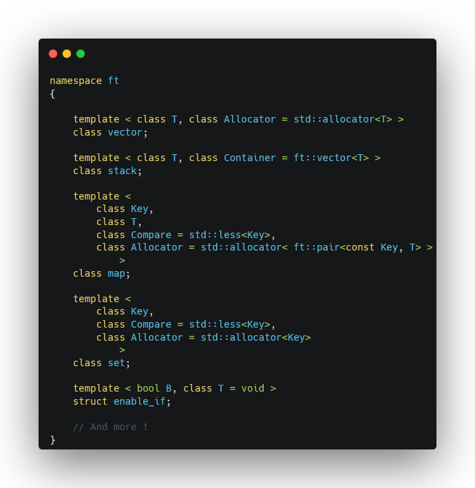

<h1 align="center">
	ft_containers
</h1>

	
	

	

## What is this ?

ft_containers is a 42 common core project, in which we are asked to re-implement part of the C++98 STL from scratch.

While this project was a pain to work through (compiler template/const errors are a nightmare to read), it taught me a lot about the inner workings of C++ and of the STL.

Indeed, I learnt a lot about red-black trees, SFINAE, iterators, templates, header-only libraries, and more. Knowing how to make your own, custom container in C++, with iterators, is definitely a skill I'm glad to have acquired. Besides, the best way to understand a tool is to re-make it yourself.

## Features
I was required to re-implement:
- `vector`
- `stack`
- `map`
- `iterator_traits`
- `reverse_iterator`
- `enable_if`, even though it's C++11
- `is_integral`
- `equal` and `lexicographical_compare`
- `pair` and `make_pair`

I also re-implemented:
- `set`
- `integral_constant`
- `distance`
- `advance`
- `prev`

`map` and `set` are implemented as red-black trees, to keep access, insertion, and deletion times compliant with the O(log(n)) requirement of these in the STL.

`vector` implements an SFINAE optimization, allowing much faster insertion and deletion times for complex types such as `std::string`, as long as they implement a `void swap(const T&)` method.
